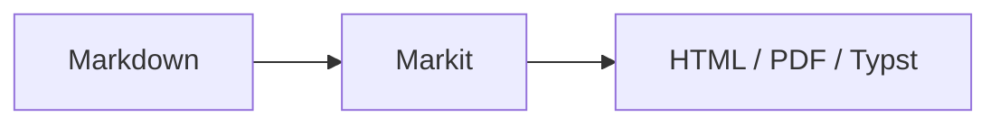
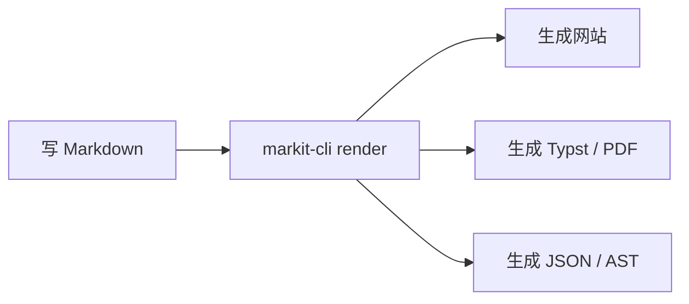
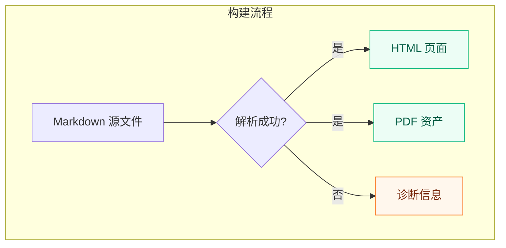
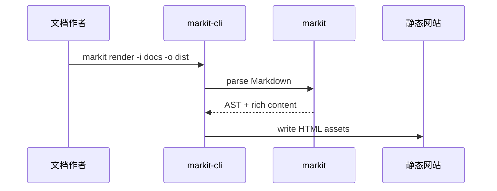
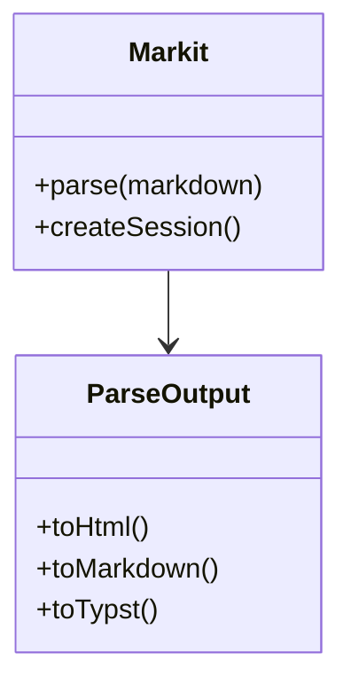
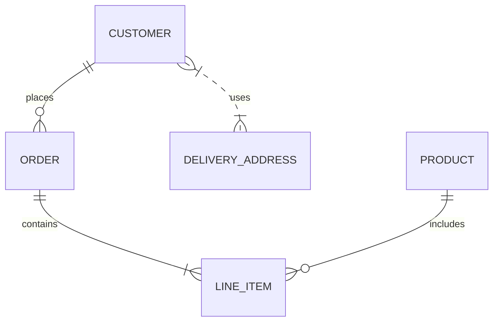
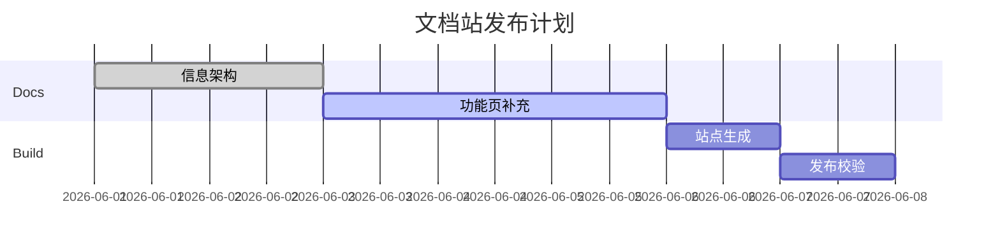
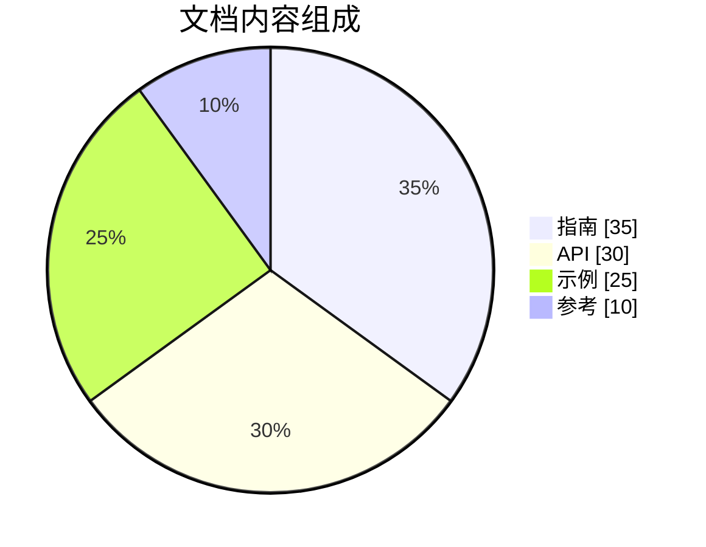
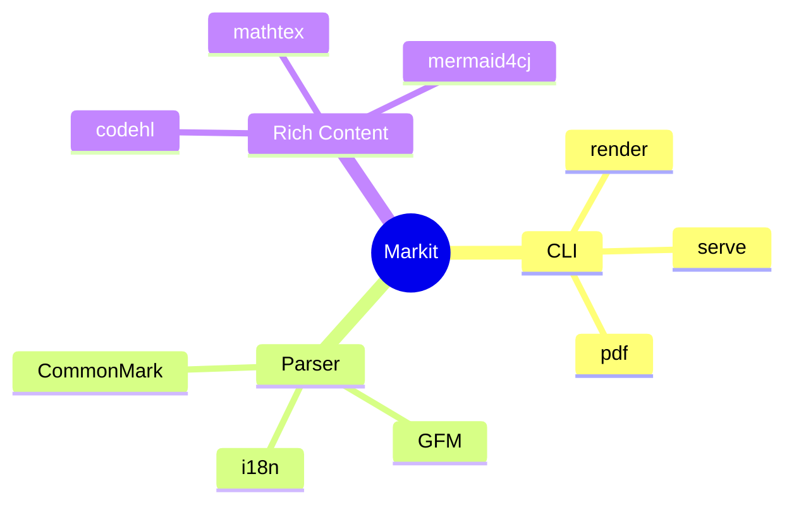
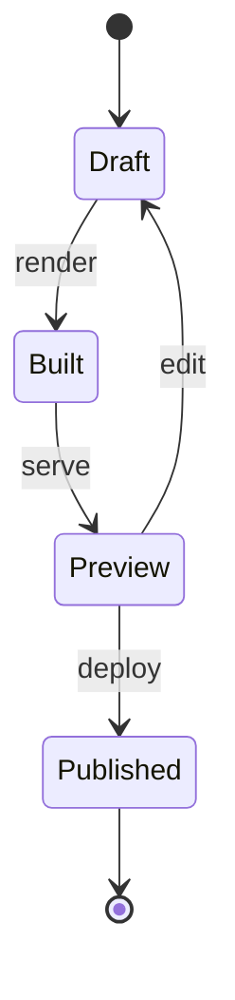

<a id="mermaid"></a>
# Mermaid 图表

Markit 的 Mermaid 图表由 `mermaid4cj` 提供。它在构建阶段把 Markdown 中的 Mermaid 代码块渲染为静态 SVG，生成的网站不需要加载 Mermaid JS；PDF/Typst 输出也可以直接引用 SVG 资产。主题颜色按 Mermaid 官方 default/dark 主题语义输出，网站模式下可以同时生成浅色和暗色 SVG。

## 引入 mermaid4cj

`mermaid4cj` 已发布到仓颉中心仓。独立使用 Mermaid SVG 渲染库时，在 `cjpm.toml` 中添加：

```toml
[dependencies]
mermaid4cj = { version = "0.2.0" }
```

## Markdown 写法

````markdown

````

markit-cli 会识别语言为 `mermaid` 的 fenced code block，并在构建阶段生成图表。

## 常用图表示例

### Flowchart



flowchart 支持常见方向、节点形状、边标签、子图、class/style 和多目标边：



### Sequence Diagram



### Class Diagram



### ER Diagram



### Gantt



### Pie



### Mindmap



### State Diagram



## 支持的图表

| 图表 | 状态 | 说明 |
| --- | --- | --- |
| `flowchart` / `graph` | 主力可用 | 支持常见节点、边、子图、class/style 和 Dagre 布局 |
| `sequenceDiagram` | 主力可用 | 支持 participant、alias、activation、note、alt/else/loop 等常见语法 |
| `classDiagram` | 主力可用 | 支持 class、成员、泛型、annotation、namespace 和常见关系 |
| `erDiagram` | 主力可用 | 支持 crow's foot cardinality、实体、属性和关系标签 |
| `gantt` | 主力可用 | 支持 title、section、任务元数据、依赖和基础时间轴 |
| `pie` | 常用子集 | 支持 title、showData、百分比和 legend |
| `mindmap` | 常用子集 | 支持缩进树和常见节点形状 |
| `stateDiagram` | 常用子集 | 支持基础 state、transition 和 composite state |

不支持的 Mermaid 类型会输出稳定的错误 SVG 和诊断信息，避免构建时静默生成错误图。

## 主题输出

网站输出可以生成浅色和暗色两份 SVG，并通过页面主题切换显示。站点主题为浅色时显示 default 主题 SVG；站点主题为暗色，或主题模式为 `auto` 且系统偏好为暗色时，显示 dark 主题 SVG。dark 主题图表会使用深色背景，这是 Mermaid 官方暗色主题的表现方式。

```html
<div class="mk-mermaid-container" data-mermaid4cj="native" data-mermaid4cj-theme="dual">
  <div class="mk-mermaid-diagram mk-mermaid-theme-light">...</div>
  <div class="mk-mermaid-diagram mk-mermaid-theme-dark">...</div>
</div>
```

PDF/Typst 输出通常生成单主题 SVG 文件，由 Typst 直接引用。

## Cangjie API

```cangjie
import mermaid4cj.{MermaidRenderer, MermaidRenderOptions, MermaidTheme}

let result = MermaidRenderer().renderSvg(
    "flowchart TD\nA[Start] --> B[Done]",
    options: MermaidRenderOptions(
        theme: MermaidTheme.Default,
        classPrefix: "mk-mermaid",
        idPrefix: "page-1-mermaid-0"
    )
)

if (result.supported) {
    println(result.svg)
}
```

同一份源码需要输出浅色、暗色或 PDF 资产时，可以先 parse 再多次 render，减少重复扫描。
