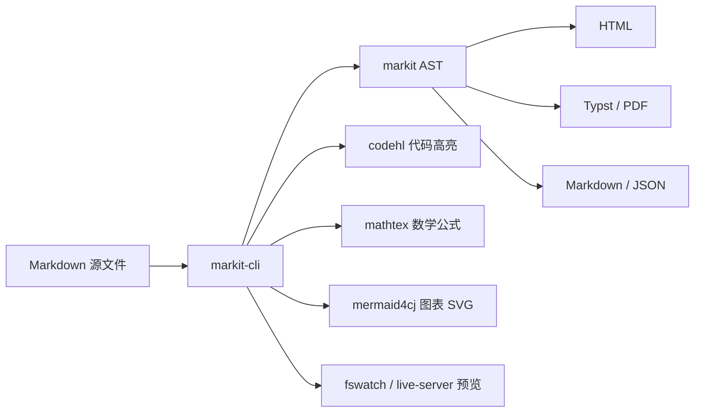

<a id="project-map"></a>
# 项目组成

Markit 是一组围绕 Markdown 文档处理构建的仓颉项目。`markit` 是解析与渲染内核，`markit-cli` 是面向用户的命令行工具，其他库提供代码高亮、数学公式、Mermaid 图表、终端框架、文件监听和开发辅助能力。

| 项目 | 定位 | 主要使用者 |
| --- | --- | --- |
| `markit` | Markdown 解析、AST、插件系统和多格式输出内核 | 文档工具、服务端、编辑器、AI 输出界面 |
| `markit-cli` | 文档站、PDF、Typst、Markdown 合并和本地预览命令行工具 | 文档作者、项目维护者、CI |
| `codehl` | 纯仓颉构建期代码高亮库 | markit-cli、需要静态代码高亮的工具 |
| `mathtex` | 纯仓颉构建期 TeX 数学公式渲染库 | markit、markit-cli、PDF/网站输出 |
| `mermaid4cj` | 构建期 Mermaid SVG 渲染库 | markit-cli、文档站、PDF 管线 |
| `commandline` | 宏驱动 CLI 框架 | markit-cli 和其他仓颉 CLI 应用 |
| `fswatch` | 跨平台文件监听库 | serve/watch、本地预览和自动化工具 |
| `live-server` | 本地静态服务能力 | 预览服务 |
| `dochir` | 仓颉 API 文档生成辅助工具 | 库文档和开发流程 |

底层 JSON 相关路径依赖第三方库 [`seajson`](https://pkg.cangjie-lang.cn/package/seajson)，包括配置读取、TextMate grammar/theme 解析以及 JSON 输出等场景。

## 引入库

Markit 系列库已上传到仓颉中心仓。仓颉项目可以在 `cjpm.toml` 中按需引入：

```toml
[dependencies]
markit = { version = "0.2.0" }
codehl = { version = "0.2.0" }
mathtex = { version = "0.2.0" }
mermaid4cj = { version = "0.2.0" }
commandline = { version = "0.2.0" }
fswatch = { version = "0.2.0" }
live_server = { version = "0.2.0" }
```

只解析 Markdown 时引入 `markit` 即可；需要独立做代码高亮、数学公式或 Mermaid 渲染时，再分别引入 `codehl`、`mathtex` 或 `mermaid4cj`。

## 推荐选择

如果你只想生成文档站或 PDF，直接使用 `markit-cli`。

如果你要在自己的仓颉程序中解析 Markdown，使用 `markit`。

如果你正在构建文档平台、编辑器预览、AI 流式输出界面或服务端转换工具，可以把 `markit` 作为核心解析层，再按需要接入 `codehl`、`mathtex` 和 `mermaid4cj`。

如果你要开发新的命令行工具，可以单独使用 `commandline`；如果工具需要监听文件变化，可以再接入 `fswatch`。

## 数据流



这组库的共同目标是把 Markdown 从“文本格式”变成可构建、可索引、可导出、可扩展的文档数据流。
