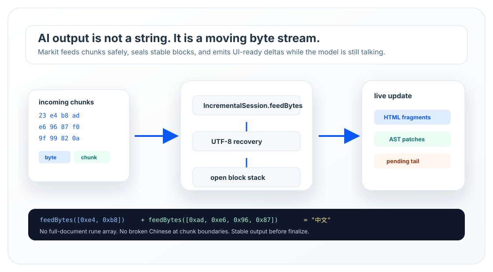
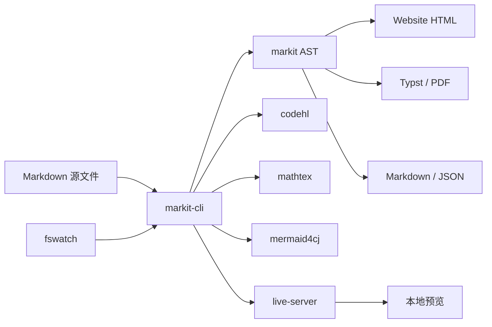

# 项目

- [项目组成](libraries/project-map.md)

- [markit 内核](libraries/markit-core.md)

- [支撑库](libraries/supporting-libraries.md)

# 入门

- [概览](getting-started/overview.md)

- [快速开始](getting-started/quick-start.md)

# 功能

- [代码块与高亮](features/code-highlighting.md)

- [数学公式](features/math.md)

- [Mermaid 图表](features/mermaid.md)

- [Bundles 与内置能力](bundles/bundles-and-builtins.md)

# CLI 与配置

- [markit-cli 使用方法](cli/markit-cli.md)

- [markit-cli 配置参考](reference/markit-cli-config.md)

- [CLI 集成提示](examples/integration/cli-integration.md)

# 核心概念

- [架构](core-concepts/architecture.md)

- [Source 模型、Node 与 Unicode](core-concepts/source-model.md)

# API 参考

- [核心 API](api-reference/core-api.md)

- [ParseOutput 与多格式输出](api-reference/output-api.md)

- [API 速查](api-reference/index.md)

# 扩展与实践

- [流式与增量解析](advanced/streaming-incremental.md)

- [插件系统、Parser 与渲染管线](plugins/plugin-system.md)

- [测试与 benchmark](advanced/testing-benchmark.md)

<!-- homepage -->

# Markit

<div class="home-hero">
<div class="home-hero-copy">
<p class="home-eyebrow">Cangjie Markdown Toolchain</p>
<h2>面向文档站、PDF、工具链与 AI 输出的一组 Markdown 项目。</h2>
<p class="home-lead">Markit 以仓颉实现 Markdown 解析、静态网站生成、PDF/Typst 输出、代码高亮、数学公式和 Mermaid 图表渲染。它既可以作为命令行工具直接服务文档作者，也可以作为一组库嵌入编辑器、服务端、自动化工具和 AI 流式输出界面。</p>
<div class="home-built-with">
<strong>本文档网站由 markit-cli 生成</strong>
<span>从 Summary 导航、标题锚点、代码块、数学公式、Mermaid 图表到静态页面输出，整站都运行在 Markit 项目自己的解析与渲染能力之上。</span>
</div>
<p class="home-actions">
<a class="btn btn-lg btn-primary" href="cli/markit-cli.html">使用 markit-cli</a>
<a class="btn btn-lg btn-outline-primary" href="getting-started/quick-start.html">快速开始</a>
<a class="btn btn-lg btn-outline-secondary" href="libraries/project-map.html">项目组成</a>
<a class="btn btn-lg btn-outline-secondary" href="https://gitcode.com/zichexuelan/markit" target="_blank" rel="noopener noreferrer">代码仓库</a>
</p>
</div>
<figure class="home-hero-visual">

</figure>
</div>

<section class="home-stream-demo-section">
<div id="markit-ai-stream-demo" class="markit-ai-stream-demo" aria-label="AI 流式 Markdown 渲染演示"></div>
</section>

## Markit 包含什么

<div class="card-grid-3 home-card-grid">
<a class="card-link" href="cli/markit-cli.html">
<div class="card card-primary">
<div class="card-title">markit-cli</div>
<div class="card-body">把 Markdown 渲染为静态网站、PDF、Typst 或合并 Markdown，内置 Summary 导航、本地预览、热重载、搜索索引和主题资源。</div>
</div>
</a>

<a class="card-link" href="libraries/markit-core.html">
<div class="card card-primary">
<div class="card-title">markit 内核</div>
<div class="card-body">提供 Markdown AST、插件系统、流式解析、多格式输出和 source span，适合服务端、编辑器、文档平台和 AI 输出界面。</div>
</div>
</a>

<a class="card-link" href="features/code-highlighting.html">
<div class="card card-primary">
<div class="card-title">codehl</div>
<div class="card-body">纯仓颉构建期代码高亮库，读取 TextMate grammar 和主题生成 HTML，网站运行时不需要 Shiki。</div>
</div>
</a>

<a class="card-link" href="features/math.html">
<div class="card card-secondary">
<div class="card-title">mathtex</div>
<div class="card-body">纯仓颉构建期 TeX 数学公式渲染库，输出 KaTeX-compatible HTML、MathML 和 Typst。</div>
</div>
</a>

<a class="card-link" href="features/mermaid.html">
<div class="card card-secondary">
<div class="card-title">mermaid4cj</div>
<div class="card-body">把 Mermaid 图表在构建阶段渲染为静态 SVG，支持按 Mermaid default/dark 主题语义输出网站明暗主题和 PDF/Typst 资产。</div>
</div>
</a>

<a class="card-link" href="libraries/supporting-libraries.html">
<div class="card card-secondary">
<div class="card-title">支撑库</div>
<div class="card-body">commandline、fswatch、live-server、dochir 等库提供 CLI 开发、文件监听、本地服务和 API 文档生成能力。</div>
</div>
</a>
</div>

## 适用场景

<div class="home-feature-grid">
<div class="home-feature">
<strong>产品文档与知识库</strong>
<span>用 Summary 组织章节，从 Markdown 生成网站、搜索索引、目录、标题锚点、代码标签、图表和公式。</span>
</div>
<div class="home-feature">
<strong>PDF 与离线手册</strong>
<span>同一份 Markdown 可以输出 Typst 和 PDF，适合发布规范文档、课程材料、API 手册和离线交付物。</span>
</div>
<div class="home-feature">
<strong>AI 流式 Markdown</strong>
<span>持续接收字节或文本 chunk，把稳定 block 与 pending tail 分开，适合聊天界面和实时预览。</span>
</div>
<div class="home-feature">
<strong>开发者工具链</strong>
<span>Markit 的解析内核、代码高亮、公式渲染、Mermaid SVG 和 CLI 框架都可以单独嵌入自己的仓颉应用。</span>
</div>
</div>

## 从 Markdown 到成品



## 常用命令

```bash
///// render-site.sh [bash]
markit render -i ./docs -o ./dist
///// serve.sh [bash]
markit serve -i ./docs -H 127.0.0.1 -p 8080
///// render-pdf.sh [bash]
markit render -i ./docs -o ./dist -c ./docs/markit-pdf.json
///// parallel.sh [bash]
markit render -i ./docs -o ./dist -j 4
```

## 库用法

Markit 系列库已发布到仓颉中心仓。仓颉项目在 `cjpm.toml` 中按需引入：

```toml
[dependencies]
markit = { version = "0.2.0" }
codehl = { version = "0.2.0" }
mathtex = { version = "0.2.0" }
mermaid4cj = { version = "0.2.0" }
commandline = { version = "0.2.0" }
fswatch = { version = "0.2.0" }
live_server = { version = "0.2.0" }
```

```cangjie
///// markit.cj [cangjie]
import markit.Markit
import markit.bundles.GFMBundle

main(): Unit {
    let out = Markit(GFMBundle()).parse("# 标题\n\n- [x] task\n")
    println(out.toHtml())
}
///// markit-stream.cj [cangjie]
let session = Markit(GFMBundle()).createSession()
session.feedBytes([0x23, 0x20])
session.feedBytes("中文标题\n\n正文".toArray())
session.feed("继续。\n\n")
session.finalize()
println(session.toHtml())
///// codehl.cj [cangjie]
import codehl.{Highlighter, HighlightOptions}

let codeHtml = Highlighter().highlight(
    "let value = 1",
    options: HighlightOptions(lang: "cangjie", themeName: "light-plus")
)
println(codeHtml)
///// mathtex.cj [cangjie]
import mathtex.{MathRenderOptions, MathRenderer}

let math = MathRenderer().renderHtmlAndMathMl(
    "\\sum_{i=1}^n x_i",
    options: MathRenderOptions(displayMode: true)
)
println(math.output)
///// mermaid4cj.cj [cangjie]
import mermaid4cj.{MermaidRenderer, MermaidRenderOptions}

let diagram = MermaidRenderer().renderSvg(
    "flowchart LR\nA[Markdown] --> B[HTML]",
    options: MermaidRenderOptions(idPrefix: "home-demo")
)
println(diagram.svg)
```

## 构建期富内容

<div class="card-grid-3 home-card-grid">
<a class="card-link" href="features/code-highlighting.html">
<div class="card card-primary">
<div class="card-title">代码块与高亮</div>
<div class="card-body">代码块支持语言标记、行高亮、多语言行过滤、多文件代码组和构建期浅色/暗色主题 HTML。</div>
</div>
</a>

<a class="card-link" href="features/math.html">
<div class="card card-primary">
<div class="card-title">数学公式</div>
<div class="card-body">行内公式和块级公式可输出 KaTeX-compatible HTML、MathML 与 Typst，适合网站和 PDF。</div>
</div>
</a>

<a class="card-link" href="features/mermaid.html">
<div class="card card-primary">
<div class="card-title">Mermaid 图表</div>
<div class="card-body">flowchart、sequence、class、ER、gantt、pie、mindmap 等图表渲染为静态 SVG。</div>
</div>
</a>
</div>

## 流式内容

<div class="card-grid-3 home-card-grid">
<a class="card-link" href="advanced/streaming-incremental.html">
<div class="card card-primary">
<div class="card-title">直接接收字节流</div>
<div class="card-body">网络分片到达时即可持续解析，中文和 emoji 边界保持安全。</div>
</div>
</a>

<a class="card-link" href="core-concepts/architecture.html">
<div class="card card-primary">
<div class="card-title">稳定内容先展示</div>
<div class="card-body">标题、段落、列表、表格和代码块在结构完整后输出，未完成内容保留在解析会话中。</div>
</div>
</a>

<a class="card-link" href="api-reference/output-api.html">
<div class="card card-primary">
<div class="card-title">多格式输出</div>
<div class="card-body">同一份解析结果可以生成 HTML、Markdown、Typst、JSON、AST 和流式更新片段。</div>
</div>
</a>
</div>
