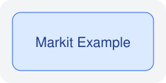

# :zh{组件总览}: :en{Component Coverage}:

::{本章尽量覆盖常用组件，后续主要拿它观察 Typst 导出和 PDF 样式。}:

:::zh
## 行内代码自动换行验证

下面这个段落专门用于验证 PDF 中行内代码自动换行后的背景和文本连续性是否正确：

`markit render --input example/chapters/layout-checks.md --output dist-example/zh/layout-checks.pdf --theme arctic --strict-mode`

下面这个表格专门用于验证最右列中的超长行内代码是否会自动换行，以及换行后的背景是否连续：
:::

:::en
## Inline Code Wrap Verification

The paragraph below is used to verify whether inline code keeps a correct background and text continuity after automatic line wrapping in the PDF:

`markit render --input example/chapters/layout-checks.md --output dist-example/zh/layout-checks.pdf --theme arctic --strict-mode`

The table below is used to verify whether very long inline code in the rightmost column wraps correctly and keeps the background continuous after wrapping:
:::

| Case | :zh{长行内代码 A}: :en{Long inline code A}: | :zh{长行内代码 B}: :en{Long inline code B}: | :zh{长行内代码 C}: :en{Long inline code C}: | :zh{长行内代码 D}: :en{Long inline code D}: |
|---|---|---|---|---|
| Paragraph | `markit render --input example/chapters/layout-checks.md --output dist-example/zh/layout-checks.pdf --theme arctic --strict-mode` | `Result<Option<Array<Int64>>>, Error<ParserFailure<RenderContext>>>` | `dist-example/zh/chapters/layout-checks/very-long-inline-code-wrap-verification.typ` | `CounterVarNameNaa++` |
| Type | `Option<compositeType>` | `expr1..=expr2:expr3` | ↵ | `CounterVarNameNaa++` |
| Increment | `counterVarName++` | `resultValue+=deltaValue` | `listExpr[indexValue]` | `VarName[expr]` |
| Assign | `leftValue = expr` | `leftValue += expr` | `leftValue -= expr` | `leftValue = expr` |
| Range | `expr1..expr2:expr3` | `expr1..=expr2:expr3` | `expr1...expr2` | `expr1..expr2:expr3` |
| Logical Assign | `leftValue \|\|= expr` | `value &&= fallback` | `result ??= defaultValue` | `leftValue \|\|= expr` |
| Logical Or | `leftValue \|\| expr` | `value && fallback` | `result ?? defaultValue` | `leftValue \|\| expr` |

> :zh{如果后面要调 PDF 样式，这一页应该是最直接的观察样本。}: :en{If we refine PDF styles later, this page should be the quickest visual sample.}:

:::zh
## 段落、强调与链接

这里包含 **粗体**、*斜体*、`行内代码`、~~删除线~~ 和 [相对链接](code-highlighting.md)。

- **单行注释**，以 `//` 开头
- **类型参数**，例如 `Array<Int64>`

自动链接示例：<https://example.com/docs>
:::

:::en
## Paragraphs, Emphasis, and Links

This section includes **bold**, *italic*, `inline code`, ~~strikethrough~~, and a [relative link](code-highlighting.md).

- **Single-line comments** start with `//`
- **Type arguments** look like `Array<Int64>`

Autolink example: <https://example.com/docs>
:::

:::zh
## 列表与任务列表
:::

:::en
## Lists and Task Lists
:::

- $T1 \equiv T2$.
:::en
- If $T1 \equiv T2$.
:::
- `T1` 是 `Nothing` 类型。
:::en
- `T1` is `Nothing` type.
:::

1. :zh{第一项包含行内代码}: :en{The first item contains inline code}: `markit render`
2. :zh{第二项包含粗体和斜体}: :en{The second item contains bold and italic text}: **Bold** / *Italic*
3. :zh{第三项包含链接}: :en{The third item contains a link}: [代码高亮](code-highlighting.md)
4. 当类型别名实际指向的类型为 enum 时，可以作为 enum 声明的构造器的类型名
:::en
4. If it is a type alias for enum, it can be used as a type name of data constructor of the enum declaration.
:::
    
    ```cangjie
    enum TimeUnit { Day | Month | Year }
    ```

- [x] :zh{已完成基础 Typst 导出}: :en{Base Typst export completed}:
- [ ] :zh{待完善代码高亮}: :en{Code highlighting still pending}:
- [ ] :zh{待优化 PDF 样式}: :en{PDF styling still pending}:

:::zh
## 表格、引用与分隔线
:::

:::en
## Tables, Quotes, and Divider
:::

---
| Block | :zh{期望}: :en{Expectation}: |
|---|---|
| Paragraph | :zh{段落有合适留白}: :en{Reasonable paragraph spacing}: |
| Code | :zh{代码块与正文拉开}: :en{Code block visually separated from body text}: |
| Link | :zh{链接在 Typst 中可点击}: :en{Links clickable in Typst/PDF}: |
| Math | :zh{行内与块级公式都能正常落地}: :en{Inline and block math should render correctly}: |
---

---

:::zh
## 数学公式

行内公式示例：$E = mc^2$，以及 $f(x) = x^2 + 2x + 1$。

块级公式示例：
:::

:::en
## Math

Inline math examples: $E = mc^2$ and $f(x) = x^2 + 2x + 1$.

Block math example:
:::

$$
\int_0^1 x^2 \, dx = \frac{1}{3}
$$

:::zh
## 图片与脚注

下面的图片使用本地资源，脚注用于测试链接和排版细节。[^demo-note]
:::

:::en
## Image and Footnote

The image below uses a local asset, and the footnote helps test link and spacing details.[^demo-note]
:::



[^demo-note]: :zh{这是一个示例脚注。}: :en{This is a sample footnote.}:

:::zh
## 通用块
:::

:::en
## Universal Block
:::

:::
这个通用块不带语言标识，理论上在所有目标语言下都应该保留。
:::
