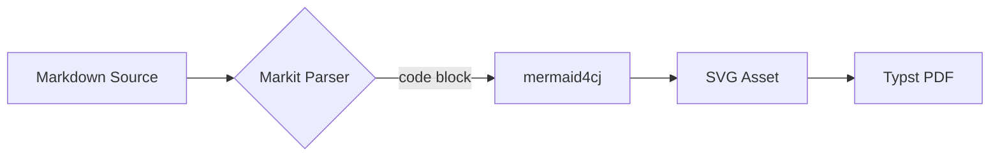
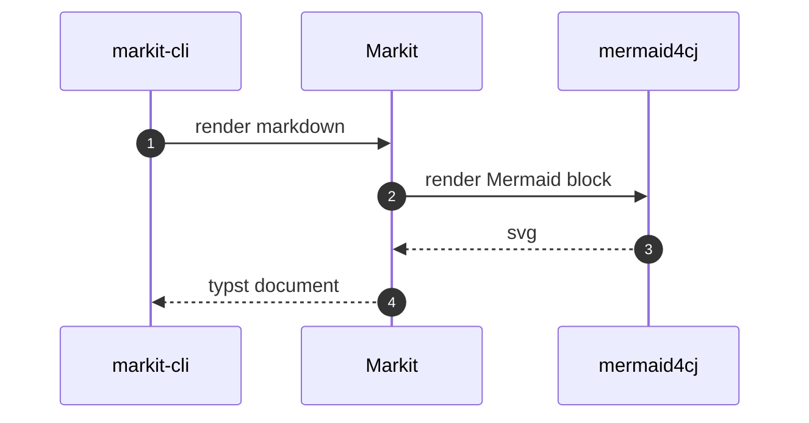
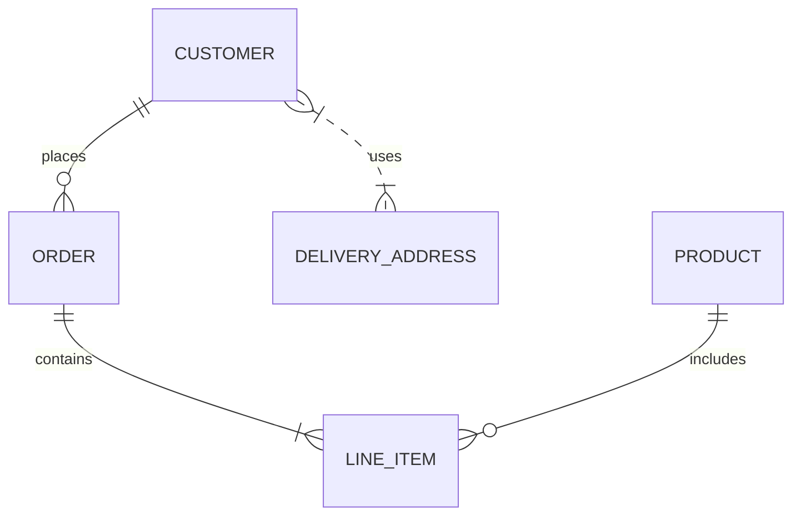
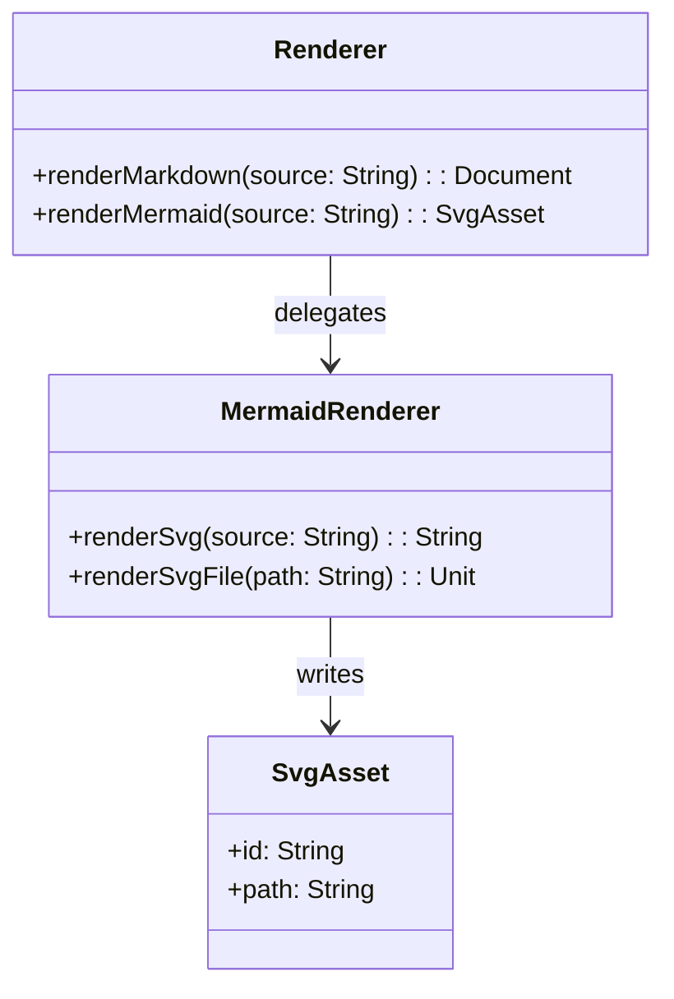
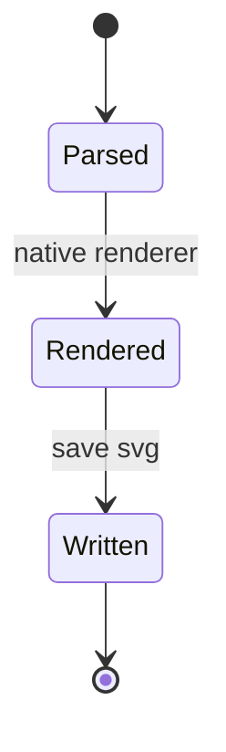
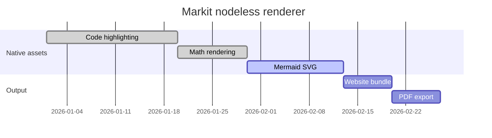
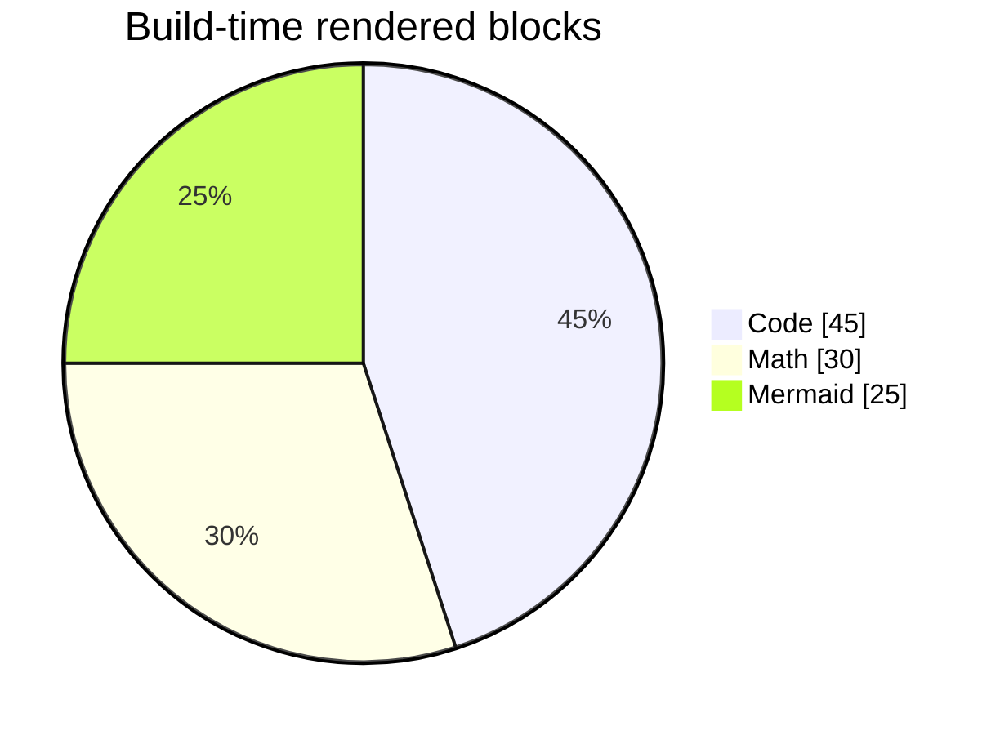
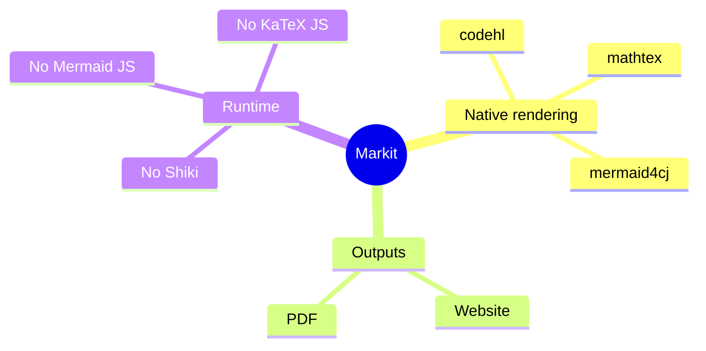

# :zh{Mermaid 图表}: :en{Mermaid Diagrams}:

::{:zh{本页用于验证 Mermaid 代码块会在构建期渲染为 SVG，并能进入 PDF 输出。}: :en{This page validates Mermaid code blocks rendered to SVG during build and included in PDF output.}:}:

## :zh{流程图}: :en{Flowchart}:

## :zh{时序图}: :en{Sequence Diagram}:

## :zh{实体关系图}: :en{Entity Relationship Diagram}:

## :zh{类图}: :en{Class Diagram}:

## :zh{状态图}: :en{State Diagram}:

## :zh{甘特图}: :en{Gantt Chart}:

## :zh{饼图}: :en{Pie Chart}:

## :zh{思维导图}: :en{Mindmap}:

